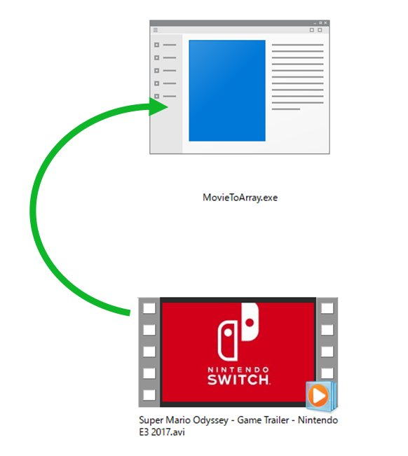

# M5Stack_Movie

## Prepare
- [M5Stack](https://www.switch-science.com/catalog/3647/)  : Switch Science

## Development Environment
- [Arduino IDE](https://www.arduino.cc/en/main/software)
- [arduino-esp32](https://github.com/espressif/arduino-esp32)

## How to play Movie
- In your PC, drag and drog a avi file into MovieToArray/MovieToArray.exe. 

- You can get a dat file.  Put the file into a SD card and set it to the slot.
- You can play the dat file by M5Stack. 

## About MovieToArray.exe
It uses DLL for Microsoft Expression Encorder 4. 
https://www.microsoft.com/ja-jp/download/details.aspx?id=18974 
You can build it from MovieToArray/Program.cs which is written by C# as a simple console program.
(You must add "Microsoft.Expression.Encoder" and "System.Drawing" by reference manager when you build it in Visual Studio.) 
